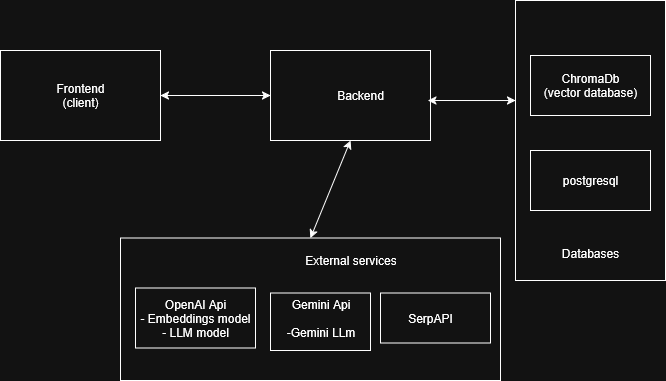
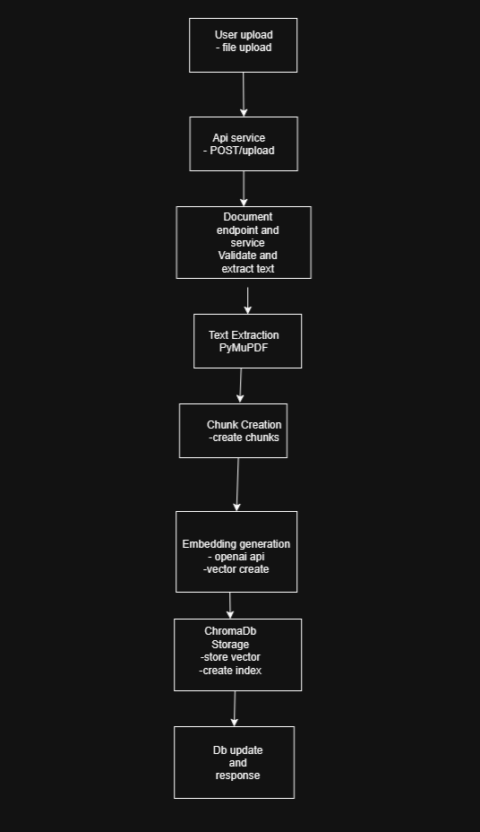
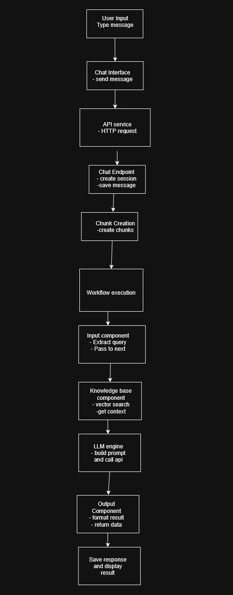

# GenAI Stack - No-Code/Low-Code AI Workflow Builder


A full-stack web application that enables users to visually create and interact with intelligent workflows using drag-and-drop components. Users can build workflows that handle user input, extract knowledge from documents, interact with language models, and return answers through a chat interface.

## 🚀 Features

### Core Components
- **User Query Component**: Entry point for user queries
- **Knowledge Base Component**: Upload and process documents (PDF, TXT, DOCX, MD)
- **LLM Engine Component**: Integration with OpenAI GPT and Google Gemini models
- **Output Component**: Chat interface for displaying responses

### Key Capabilities
- **Visual Workflow Builder**: Drag-and-drop interface using React Flow
- **Document Processing**: Extract text using PyMuPDF and PyPDF2
- **Vector Search**: Store and search documents using ChromaDB
- **Web Search**: Integration with SerpAPI for real-time information
- **Multi-LLM Support**: OpenAI GPT-5-nano and Gemini-2.5-pro
- **Real-time Chat**: Interactive chat interface with workflow execution
- **Workflow Persistence**: Save and load workflows from database

## 🏗️ Architecture



### High-Level System Architecture


## 🛠️ Tech Stack

### Frontend
- **React.js** - UI framework
- **React Flow** - Drag-and-drop workflow builder
- **Vite** - Build tool and dev server
- **CSS3** - Styling

### Backend
- **FastAPI** - Python web framework
- **SQLAlchemy** - ORM
- **Alembic** - Database migrations
- **Pydantic** - Data validation

### Database & Storage
- **PostgreSQL** - Primary database
- **ChromaDB** - Vector database for embeddings

### AI & ML Services
- **OpenAI API** - GPT models and embeddings
- **Google Gemini API** - Gemini models
- **SerpAPI** - Web search functionality

### Document Processing
- **PyMuPDF** - Advanced PDF text extraction


## 📋 Prerequisites

- **Docker** (recommended)
- **Python 3.11+** (for local development)
- **Node.js 18+** (for local development)
- **PostgreSQL 15+** (for local development)

### API Keys Required
- **OpenAI API Key** - For GPT models and embeddings
- **Google Gemini API Key** - For Gemini models
- **SerpAPI Key** - For web search (optional)

## 🚀 Quick Start with Docker

### 1. Clone the Repository
```bash
git clone <repository-url>
cd aiplanet-tech-assessment
```

### 2. Environment Setup
```bash
# Copy environment template
cp backend/env.example .env

# Edit .env file with your API keys
nano .env
```

Required environment variables:
```env
# OpenAI Configuration
OPENAI_API_KEY=your_openai_api_key_here

# Google Gemini Configuration
GEMINI_API_KEY=your_gemini_api_key_here

# SerpAPI Configuration (Optional)
SERPAPI_API_KEY=your_serpapi_key_here
```

### 3. Start the Application
```bash
# Start all services
docker-compose up -d

# View logs
docker-compose logs -f

# Check service status
docker-compose ps
```

### 4. Access the Application
- **Frontend**: http://localhost:5173
- **Backend API**: http://localhost:8000
- **API Documentation**: http://localhost:8000/docs
- **pgAdmin** (optional): http://localhost:5050

## 🛠️ Local Development Setup

### Backend Setup
```bash
cd backend

# Create virtual environment
python -m venv venv
source venv/bin/activate  # On Windows: venv\Scripts\activate

# Install dependencies
pip install -r requirements.txt

# Set up environment variables
cp env.example .env
# Edit .env with your API keys

# Run database migrations
alembic upgrade head

# Start the backend server
python main.py
```

### Frontend Setup
```bash
cd frontend

# Install dependencies
npm install

# Start development server
npm run dev
```

### Database Setup
```bash
# Start PostgreSQL (if not using Docker)
# Create database
createdb genai_stack

# Run migrations
cd backend
alembic upgrade head
```

## 📖 Usage Guide

### 1. Create a Workflow
1. Open the application at http://localhost:3000
2. Click "Create New Stack"
3. Enter a name and description
4. Drag components from the left panel to the canvas
5. Connect components by dragging from one node to another

### 2. Configure Components

#### User Query Component
- No configuration needed
- Serves as the entry point for user queries

#### Knowledge Base Component
- Click "Upload Documents" to add PDF, TXT, DOCX, or MD files
- Documents are automatically processed and stored in vector database
- Embedding model is set to `text-embedding-ada-002`

#### LLM Engine Component
- Select model: GPT-5-nano or Gemini-2.5-pro
- Configure API keys (or use default)
- Set temperature and max tokens

#### Output Component
- Displays final responses
- No configuration needed

### 3. Execute Workflow
1. Click "Save" to save your workflow
2. Click the chat button (💬) to open chat interface
3. Type your query and press Enter
4. Watch the workflow execute and return results

### 4. Workflow Flow
```
User Query → Knowledge Base (optional) → LLM Engine → Output
```

## 📊 Document Processing Flow



The document processing pipeline handles various file formats and creates searchable vector embeddings:

1. **File Upload** → User uploads PDF, TXT, DOCX, or MD files
2. **Text Extraction** → Extract text using PyMuPDF, PyPDF2, or python-docx
3. **Chunking** → Split text into manageable chunks for processing
4. **Embedding Generation** → Create vector embeddings using OpenAI API
5. **Vector Storage** → Store embeddings in ChromaDB for similarity search
6. **Indexing** → Create searchable indexes for fast retrieval

## ⚡ Workflow Execution Flow



The workflow execution engine processes components in the correct order:

1. **User Input** → User sends message through chat interface
2. **Session Management** → Create or update chat session
3. **Component Execution** → Process each component in sequence:
   - **Input Component** → Extract and validate user query
   - **Knowledge Base** → Search vector database for relevant context
   - **LLM Engine** → Generate AI response using context and query
   - **Output Component** → Format and return final response
4. **Response Delivery** → Send result back to user interface

## 🔧 API Endpoints

### Workflows
- `GET /api/v1/workflows` - List all workflows
- `POST /api/v1/workflows` - Create new workflow
- `GET /api/v1/workflows/{id}` - Get workflow details
- `PUT /api/v1/workflows/{id}` - Update workflow
- `DELETE /api/v1/workflows/{id}` - Delete workflow
- `POST /api/v1/workflows/{id}/execute` - Execute workflow

### Documents
- `POST /api/v1/documents/upload` - Upload document
- `POST /api/v1/documents/{id}/process` - Process document
- `GET /api/v1/documents` - List documents
- `GET /api/v1/documents/search` - Search documents

### Chat
- `POST /api/v1/chat/sessions` - Create chat session
- `POST /api/v1/chat/sessions/{id}/messages` - Send message
- `GET /api/v1/chat/sessions/{id}/messages` - Get chat history


### Documentation
- [Complete Code Structure Documentation](CODE_STRUCTURE_DOCUMENTATION.md)

